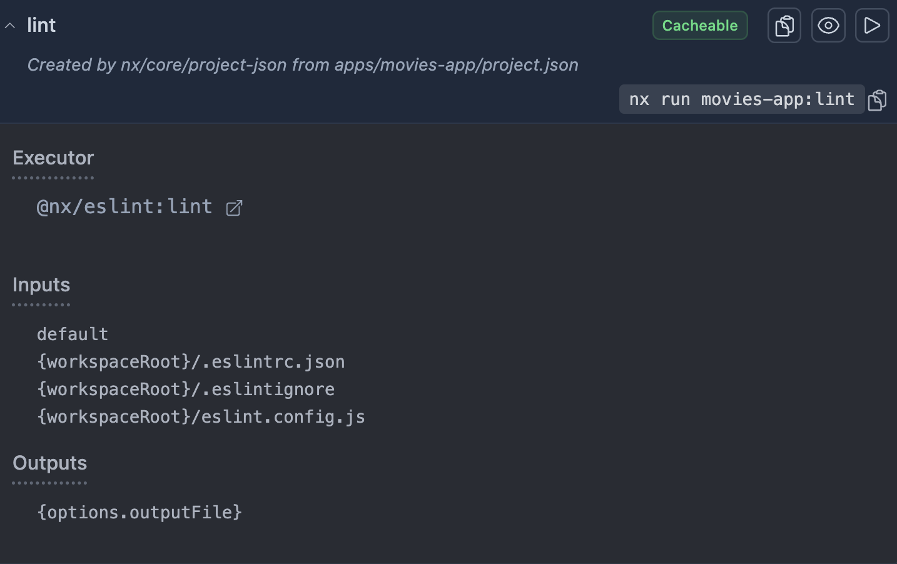
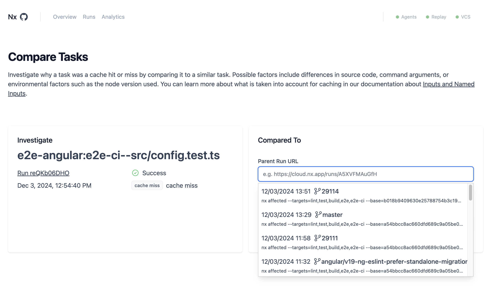

# `📖 Exercise:` Cache miss debugging, optimizations and fine tuning of inputs and outputs

## 📚&nbsp;&nbsp;**Learning outcomes**
- Learn how to debug cache misses
- Understand how task inputs work and how to configure them for the best caching results

## 🏋️‍♀️&nbsp;&nbsp;Steps:

### 1. Understanding the task hash

Everytime we run a task, Nx will associate a hash signature to that task run.

The hash signature is based on following variables:
- Command being run
- Project's configuration (and its dependencies)
- Contents of task inputs (and its dependencies)
- Executor being invoked by the command

First parameter is obvious. If you run `nx build movies-app`, Nx will store the command signature in the hash details and use it to calculate the final hash. Every time the command changes ever so slightly, for example when running it with `--prod` or `--verbose`, will change the final hash stamp.

Each tasks is defined by list of inputs that define the context upon which we run the task command. Inputs can be defined in `nx.json` as `targetDefaults`, in `project.json` and `package.json` target's configuration or any combination of the above. The best way to get the full list of inputs is by using `Nx Console` IDE extension or by running `nx graph`.



Some files are explicitly specified, while others are represented by `namedInputs`. Named inputs are variables that encapsulate common file groups. The two typical ones are:
- `default` - includes all the files in the project
- `production` - exludes all files that are not production relevant like `spec.ts` files and lint and test configurations.

Any change to files included in the inputs will result in the new hash signature.

Try running the `build` for `movies-api`. Running the build for the second time should result in the cache hit. If you change for example `main.ts` next run will result in cache miss. But if we change the `app.controller.spec.ts` our `build` should still be retrieved from the cache, because we didn't change the production file set.

### 2. Runtime and environment inputs

Besides the file contents inputs, our tasks can also depend on runtime and environment variables and even outputs of their dependencies. As we will see in the next lab, this will become crucial to limit the cases when `deploy` target should run.

Let's try playing with those inputs. Add to build target in `movies-api` `project.json` following runtime input:

```jsonc
"build": {
  // ...
  "inputs": [{ "runtime": "date" }]
  // ...
}
```

Try running `nx build movies-api` several times in a row. Notice how we are no longer getting cache hits. That's because our runtime input keeps changing.

Replace that input now with a more controlled `environment` input:

```jsonc
"build": {
  // ...
  "inputs": [{ "env": "MY_SECRET" }]
  // ...
}
```

Now run the command with `MY_SECRET=one nx build movies-api`. 

Notice how first time the cache will be busted, but then subseqent runs will result in cache hits.

Change the value of the `MY_SECRET` parameter so see how that affects the caching.

Whenever our task depends on environment where it's being invoked or upon some external tool that we can't control within Nx itself we can use those two inputs to ensure caching is accurate.

### 3. Debugging the task cache miss

Sometimes we get cache miss despite expecting a cache hit. Investigating why certain task was not retrieved from the cache can seem a difficult task. Let's learn some steps that will help us investigate cache misses.

By prefixing your command with `NX_NATIVE_LOGGING=trace NX_DAEMON=false ...` your task will be printed out with the full Rust trace which will include all the details about hashing. Look for the following section - `hashes=NapiDashMap({ ... })`. It containst the large object with HashDetails of all the tasks involved in your tast run.

Finally, in case of cache hit, you will see the block starting with:
```bash
TRACE nx::native::cache::cache: GET {some hash number}
```

It will contain the details on the location of your task cache location and ID.

This output is unfortunately not ergonomic, but luckily Nx Cloud UI has a more convenient tool that can compare two different runs.

On your CIPE select a task whose cache status you'd like to investigate, click on `Compare to Similar Tasks` button and then select a task from the list to compare them.



The result will show the inputs of those two task runs next to each other.

Make a change, push changes to `main` and then compare it with previous run to see the hash differences marked in the UI.

Notice the following sections in the output hash details:
- Globs, project configuration and TsConfig for each dependency
- `workspace:...` section at the end representing the hash stamps of `nx.json` and other core configuration files
- `npmDependencies` representing the stamp of all the dependencies used in the project or its dependencies
- Depending on the command run you might see also `env:` section in there as well

### 4. Executor dependencies

Remember how we mentioned that our task hash also depends on the executor triggering the task.

Each executor is represented by the NPM package that contains it, as well as its dependencies. These end up in the `npmDependencies` section. There is a caviat though. When you are running custom third-party executor or `run-commands` we have no control or guarantee on which packages might be involved in the invocation so all packages are included.

As you will learn in the next lab, there is one input configuration that can limit this.

For the time being, it's important to be aware of this behavior.
To test it, try to install some package that is not used by any task e.g. `npm i -D jquery`.

If you run your `lint` now the results should still be retrieved from the cache. But if you run `deploy` notice how the command is running in full.

> ⚠️&nbsp;&nbsp;Don't forget to revert the changes to package.json and the lock file. We don't need jQuery in there 😃

### 5. Final thoughts

In this lab we learned how to optimize our task inputs to get the best caching results. In the next lab we will use some of those learnings to implement the continuous deployment in the most optimal way.

## [➡️ Next lab ➡️](./continuous-deployment.md)
