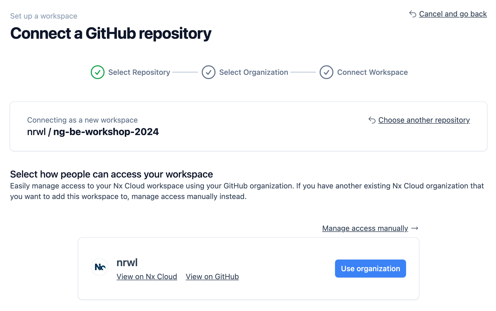
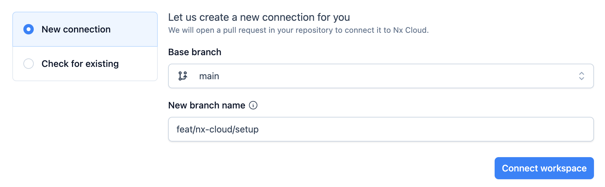
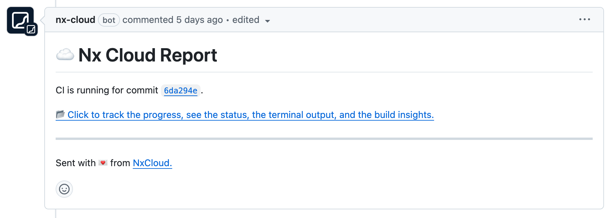

# `📖 Exercise:` Setup CI with Nx Cloud's remote caching

## 📚&nbsp;&nbsp;**Learning outcomes**

- Learn how to generate CI pipeline configuration
- Learn what Nx Cloud is and how it is used for remote caching

## 🏋️‍♀️&nbsp;&nbsp;Steps:

### 1. Prepare repo for setup

Before we can begin working with CI setup, let's make sure our repository is pushed to GitHub.

```bash
git add .
git commit -m 'finish lab 4'
git push origin main
```

### 2. Generate CI configuration

We will use the `ci-workflow` generator to generate a new configuration. Choose `github` when asked to the provider:

```bash
 NX  Generating @nx/workspace:ci-workflow

? What is your target CI provider? …
github
circleci
azure
bitbucket-pipelines
gitlab
```

Check the modified and created files to understand what was added. Since any potential change to our pipeline can break the cache we want to have this file be part of our inputs.

> ⚠️&nbsp;&nbsp;Don't worry if you don't understand what inputs are and how they affect the tasks. We'll get to it in our next lab.

### 3. Make changes to trigger pipeline

Commit changes to main branch and then create a new branch.

<details>
<summary>🐳&nbsp;&nbsp;Hint</summary>

```bash
git add . && git commit -m "add ci"
git push origin main
git checkout -b dynamic-title
```

</details>

Right now our application has hardcoded title `HubMovies`. Let's make this controllable via code. In your `apps/movies-app/src/app/app.routes.ts` add `title` property to each route e.g.:

```ts
  {
    path: 'list/:category',
    loadComponent: () =>
      import('@nx-workshop/movies/feature-movie-list').then(
        m => m.MovieListPageComponent
      ),
    title: 'Movies List' // <-- Add this
  },
```

As a `✨ BONUS` you can implement your own [Custom Title Strategy](https://angular.dev/guide/routing/common-router-tasks#setting-the-page-title) to make it more dynamic.

### 4. Create pull request and monitor changes

Commit all your changes and push them to the new branch. Now go to GitHub and make a Pull Request to `main`.

Go to `Actions` tab and click on the new running action.

Inspect the CI run results. Expand the section where your pipeline code is executed. It'll give
you information in form of a link that points to the nx cloud dashboard, representing the current run on CI.


There you can inspect the outcome of tasks. You see the stdout of the respective command.

### 5. Calculating the base for your affected command

Notice how one of the steps is `Run nrwl/nx-set-shas...`. Our affected command needs a starting and ending point. Nx will then collect all file changes between those two point in the Git history and use it to calculate affected graph. By default thes values are set to:

- `base=HEAD~1` - the previous commit
- `head=HEAD` - the current commit


However, the default values might be what we usually want. In case of pull request we want to always compare against the branching point from the `main` branch regardless on how many commits our branch has. Similarly on the `main` branch, some of the commits might have failed or get cancelled so comparing against the previous commit would lead to a potential error swallowing.

The `nx-set-shas` solves that by calculating the last successful pipeline run and feeding that to `nx affected` as `base`.

Let's make sure our PR is successful and merge it back to main.

### 6. Connect Nx Cloud

Let's pull the latest changes from our repo to be in sync with GitHub. In this step we will connect the Nx Cloud.

```bash
npx nx connect
```

This command will automatically open a tab in your browser.



Follow the steps to connect your workspace.



Once you hit the `Connect workspace` button Nx Cloud will create a branch on your repo. Open the pull request and monitor the changes it made. Once the CI run is successfully finished, merge it to the main branch.

### 7. Investigate the difference

Once you merge it, the push to `main` will trigger another pipeline run. Notice the difference in the `GitHub`.

Make another small change in your code (e.g. add some line comment). Create another branch and pull request. Notice how Nx Cloud Bot has appeared now.



Use the link provided in the bot to navigate to your CIPE run within Nx Cloud. Click on the runs as they appear to see the details of all the tasks that were run.

Notice how backend project was skipped since it was not affected by this change.

Now make another change, this time in models project. Notice how both applications will end up being affected.

### 8. Local run benefits

Merge again all your pull requests as soon as they are ready. Run `npx nx reset` to wipe your entire local cache.
Switch to the main branch and pull the latest changes from git.

```bash
git checkout main
npx nx reset
git pull
```

Now run any test, lint or build command. Notice how it's being retreived from the remote cache.


## [➡️ Next lab ➡️](.)
